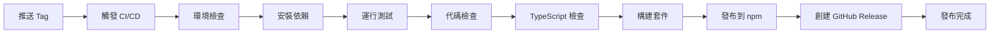

# 🚀 發布流程指南

> 本文檔詳細說明了 Vue Table Components 的發布流程，包括自動化和手動發布方式。

## 📋 發布概覽

本專案採用現代化的 CI/CD 流程，支援自動化發布和手動發布兩種方式。

### 🎯 發布策略

- **自動發布**: 推送 tag 時觸發 GitHub Actions 自動發布
- **手動發布**: 使用發布腳本或手動執行命令
- **版本管理**: 遵循 [Semantic Versioning](https://semver.org/) 規範

## 🤖 自動化發布（推薦）

### 觸發條件

| 觸發方式 | 條件 | 說明 |
|---------|------|------|
| **Tag 推送** | `v*` 格式的 tag | 推送版本標籤時自動發布 |
| **手動觸發** | GitHub Actions 頁面 | 在 Actions 頁面手動觸發工作流程 |
| **PR 合併** | 合併到 `main` 分支 | 可選：自動創建預發布版本 |

### 自動發布流程



### CI/CD 流程詳情

1. **🔍 環境檢查**
   - Node.js 版本驗證
   - npm 版本驗證
   - 環境變數檢查

2. **📦 依賴安裝**
   ```bash
   npm ci
   ```

3. **🧪 品質檢查**
   ```bash
   npm run test:unit    # 單元測試
   npm run lint         # 代碼風格檢查
   npm run type-check   # TypeScript 類型檢查
   ```

4. **🏗️ 構建套件**
   ```bash
   npm run build-lib
   ```

5. **🚀 發布到 npm**
   ```bash
   npm publish
   ```

6. **📝 創建 GitHub Release**
   - 自動生成 Release Notes
   - 上傳構建產物
   - 標記版本

## 📦 手動發布

當需要手動控制發布流程時，可以使用以下方式：

### 🔧 使用發布腳本（推薦）

```bash
# 修復版本 (1.0.0 -> 1.0.1)
./scripts/release.sh patch

# 次要版本 (1.0.0 -> 1.1.0) 
./scripts/release.sh minor

# 主要版本 (1.0.0 -> 2.0.0)
./scripts/release.sh major

# 預發布版本
./scripts/release.sh prerelease
```

發布腳本會自動執行：
- ✅ 運行所有測試
- ✅ 代碼品質檢查
- ✅ 構建套件
- ✅ 更新版本號
- ✅ 創建 git tag
- ✅ 推送到遠端
- ✅ 發布到 npm

### ⚙️ 完整手動步驟

如果需要完全手動控制每個步驟：

```bash
# 1. 確保代碼最新
git checkout main
git pull origin main

# 2. 清理並安裝依賴
rm -rf node_modules package-lock.json
npm install

# 3. 運行所有檢查
npm run test:unit
npm run lint
npm run type-check

# 4. 構建套件
npm run build-lib

# 5. 更新版本號
npm version patch  # 或 minor, major

# 6. 發布到 npm
npm publish

# 7. 推送 tags 到 GitHub
git push origin main --tags
```

### 🧪 預發布版本

用於測試和驗證：

```bash
# 創建 beta 版本
npm version prerelease --preid=beta
npm publish --tag beta

# 創建 alpha 版本  
npm version prerelease --preid=alpha
npm publish --tag alpha

# 創建 rc 版本
npm version prerelease --preid=rc
npm publish --tag next
```

## 🔧 環境設置

### GitHub Actions 設置

#### 1. NPM Token 配置

在 GitHub Repository Settings > Secrets and variables > Actions 中添加：

| Secret 名稱 | 值 | 說明 |
|------------|----|----|
| `NPM_TOKEN` | `npm_xxxxxxxxxx` | npm 自動化 token |
| `GITHUB_TOKEN` | 自動提供 | GitHub API token |

#### 2. 獲取 NPM Token

```bash
# 方式 1: 使用 npm CLI
npm login
npm token create --read-only  # 只讀權限
npm token create             # 發布權限

# 方式 2: 通過 npmjs.com 網站
```

詳細步驟：
1. 登入 [npmjs.com](https://npmjs.com)
2. 點擊頭像 > Access Tokens
3. Generate New Token > Automation
4. 複製 token 到 GitHub Secrets

#### 3. GitHub Actions 工作流程

確保 `.github/workflows/release.yml` 文件存在且配置正確。

### 本地開發設置

```bash
# 1. 確保 npm 已登入
npm whoami

# 2. 如果未登入，執行登入
npm login

# 3. 驗證發布權限
npm access list packages
```

## 📋 發布檢查清單

### 發布前必檢項目

- [ ] **代碼品質**
  - [ ] 所有測試通過 (`npm run test:unit`)
  - [ ] Linting 檢查通過 (`npm run lint`)
  - [ ] TypeScript 類型檢查通過 (`npm run type-check`)
  - [ ] 構建成功 (`npm run build-lib`)

- [ ] **文檔更新**
  - [ ] README.md 內容最新
  - [ ] API 文檔與代碼一致
  - [ ] CHANGELOG.md 已更新
  - [ ] 版本號正確

- [ ] **環境配置**
  - [ ] NPM Token 設置正確
  - [ ] GitHub Secrets 配置完整
  - [ ] 發布權限確認

- [ ] **套件配置**
  - [ ] package.json 信息正確
  - [ ] .npmignore 文件完整
  - [ ] 構建產物檢查

### 發布後驗證

- [ ] npm 套件可正常安裝
- [ ] 組件功能正常
- [ ] TypeScript 類型提示正確
- [ ] GitHub Release 創建成功

## 🎯 版本管理規範

遵循 [Semantic Versioning 2.0.0](https://semver.org/) 規範：

### 版本號格式：`MAJOR.MINOR.PATCH`

| 類型 | 說明 | 示例 | 何時使用 |
|------|------|------|---------|
| **MAJOR** | 破壞性變更 | `1.0.0` → `2.0.0` | API 不兼容的變更 |
| **MINOR** | 新功能 | `1.0.0` → `1.1.0` | 向後兼容的功能增加 |
| **PATCH** | 修復 | `1.0.0` → `1.0.1` | 向後兼容的問題修復 |

### 預發布版本

| 類型 | 格式 | 說明 | 使用場景 |
|------|------|------|---------|
| **Alpha** | `1.0.0-alpha.1` | 早期測試版本 | 內部測試 |
| **Beta** | `1.0.0-beta.1` | 功能完整測試版 | 公開測試 |
| **RC** | `1.0.0-rc.1` | 發布候選版本 | 最終測試 |

### 版本更新示例

```bash
# 從 1.0.0 開始
npm version patch   # → 1.0.1 (修復 bug)
npm version minor   # → 1.1.0 (新功能)
npm version major   # → 2.0.0 (破壞性變更)

# 預發布版本
npm version prerelease --preid=alpha  # → 2.0.1-alpha.0
npm version prerelease                # → 2.0.1-alpha.1
npm version premajor --preid=beta     # → 3.0.0-beta.0
```

## 🚨 緊急發布流程

### 熱修復發布

當發現嚴重問題需要緊急修復時：

```bash
# 1. 創建熱修復分支
git checkout -b hotfix/critical-fix

# 2. 修復問題並測試
# ... 進行修復 ...

# 3. 快速發布
npm version patch
npm run build-lib
npm publish

# 4. 合併回主分支
git checkout main
git merge hotfix/critical-fix
git push origin main --tags
```

### 回滾策略

```bash
# 撤回發布（24小時內）
npm unpublish rayyy-vue-table-components@1.0.1

# 標記為廢棄
npm deprecate rayyy-vue-table-components@1.0.1 "Critical bug, use 1.0.2"

# 發布修復版本
npm version patch
npm publish
```

## 📊 發布監控

### 發布後檢查

```bash
# 檢查套件信息
npm info rayyy-vue-table-components

# 檢查最新版本
npm view rayyy-vue-table-components version

# 檢查下載統計
npm view rayyy-vue-table-components --json
```

### 監控指標

- 📈 下載量趨勢
- 🐛 問題回報數量
- ⭐ GitHub Stars 增長
- 💬 社區反饋

## 🤝 團隊協作

### 發布權限管理

```bash
# 查看套件維護者
npm owner ls rayyy-vue-table-components

# 添加維護者
npm owner add username rayyy-vue-table-components

# 移除維護者
npm owner rm username rayyy-vue-table-components
```

### 發布通知

發布完成後，通知相關人員：
- 📧 發送發布通知郵件
- 💬 在團隊群組分享更新
- 📝 更新項目文檔
- 🔗 分享到社交媒體

---

## 📞 支援與協助

如果在發布過程中遇到問題：

- 📋 查看 [PUBLISH_CHECKLIST.md](./PUBLISH_CHECKLIST.md) 詳細檢查清單
- 🐛 提交 [GitHub Issues](https://github.com/your-username/vue-table-components/issues)
- 💬 參與 [GitHub Discussions](https://github.com/your-username/vue-table-components/discussions)
- 📧 聯繫維護團隊
